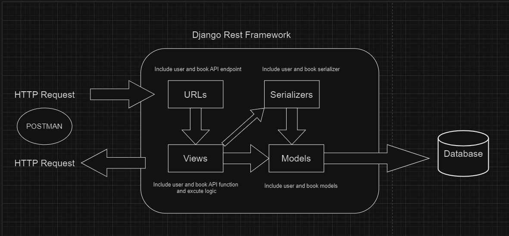

# This is project about book api using Django Rest Framework

### Live server: https://django-book-app.onrender.com

### Diagram

## Setup Project

1. Clone the project by using command **git clone** https://github.com/resola-ai/challenge-ocelot.git
2. Create python enviroment using command **python3 -m venv venv**
3. Active the python enviroment, in **Windows** it will be **venv\Scripts\activate** and in **Ubuntu** or **MacOS** it will be **source venv/bin/activate**
   **Note**: In **Windows** if you get the error that can not activate the venv, then run this script **Set-ExecutionPolicy Unrestricted -Scope Process** before active venv again
4. Install **requirements.txt** file using command **pip install -r requirements.txt**
5. Run command **python manage.py makemigrations** && **python manage.py migrate**
   **Note**: It will create a sqlite3 database by default, if you want to use another database, then you can go to **book_challenge/settings/settings_dev.py** and change the database that you want
6. Start the project by run this command **python manage.py runserver**
   
## API
### This project include these APIs
#### User API
- **Register user**
  This API use for register a new user
- **Login user**
  This API use for login a register user
- **Logout user**
  This API use for logout a login user

#### Book API
- **Books list**
  This API use for get a list all the books
- **Book get by Id**
  This API use for get a single book by book id
- **Book create**
  This API use for create a new book
- **Book update**
  This API use for update a book by book id
- **Book delete**
  This API use for delete a book by book id